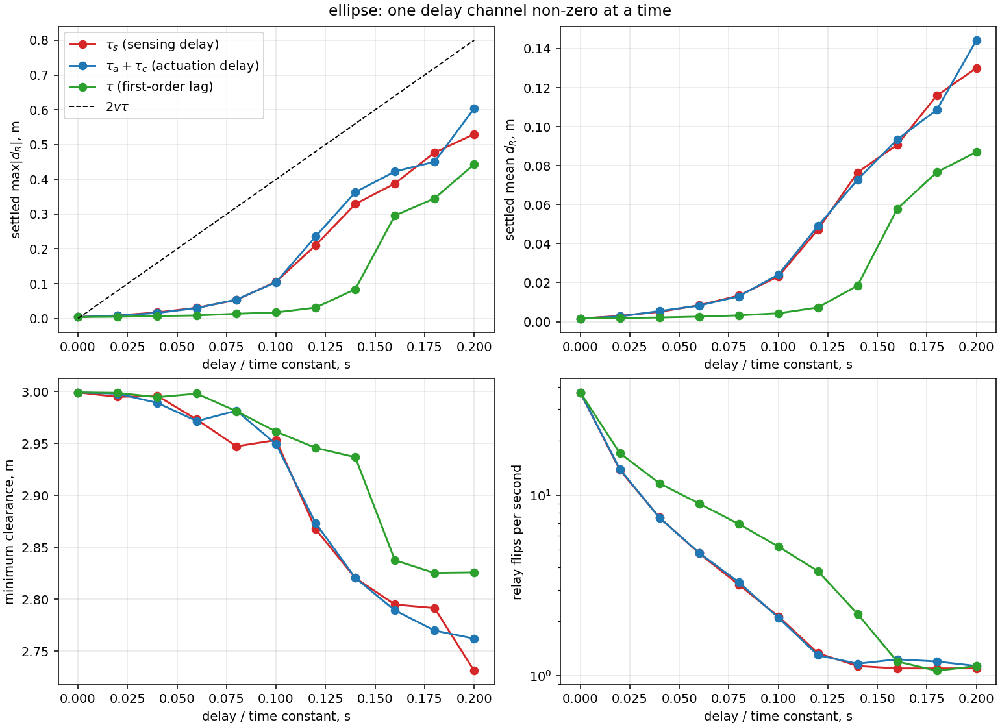
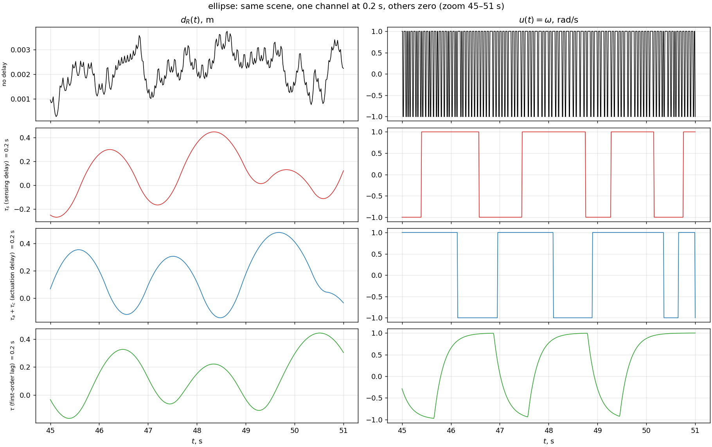
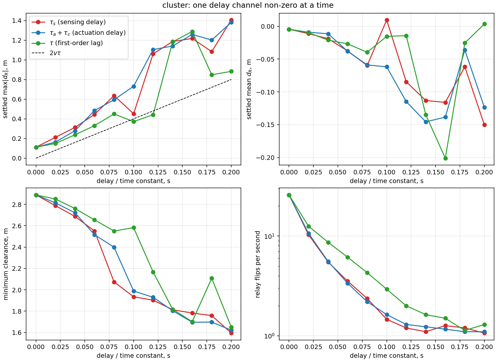
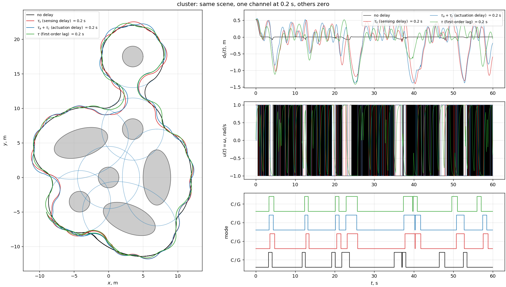
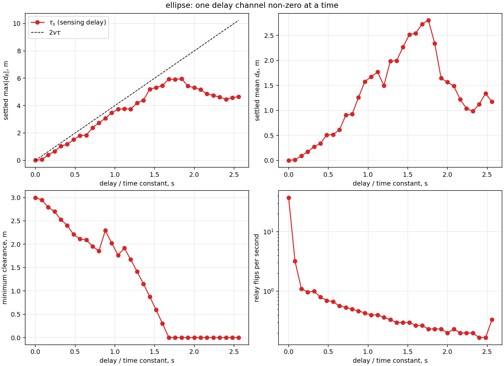

# Задержки в контуре и скользящий режим реле: отчёт об эксперименте

Что сделано: в симулятор добавлены три независимых канала задержки, и для каждого
измерено, как он портит работу релейного закона обхода препятствия
(`ReactiveCircumnavController`, режимы `C` и `G`). Закон управления не менялся.

Все числа ниже получены скриптами из репозитория (команды в разделе 9) и
воспроизводятся. Данные лежат в `simulation_output/` (в `.gitignore`), графики
скопированы в [`docs/figures/`](figures/).

---

## 1. Постановка

**Объект.** Машина Дубинса `ẋ = v cosθ, ẏ = v sinθ, θ̇ = ω`, `v = 2 м/с`,
`|ω| = 1 рад/с`, `R_min = v/ω = 2 м`. Точная дискретизация с удержанием нуля
(ZOH).

**Закон.** Реле на скользящей переменной

$$
s = \dot d_R + \kappa\,\mathrm{sat}(d_R;\pm\delta),\qquad
u = \bar\omega\,\mathrm{sign}(s),
$$

$\kappa = 6$ (`dead_zone_gain`), $\delta = 0.1$ м (`dead_zone`), $\bar\omega = 1$.
Регулируемая величина $d_R$: в режиме `C` это $\rho-\rho_0$, в режиме `G` это
$R_{\min}-\|r-V\|$. Чем чаще переключается реле, тем плотнее $s$ держится у нуля.

**Параметры сцены.** $\rho_0 = 3$ м, радиус датчика $R_s = 12$ м, период управления
$T = 0.02$ с, шаг интегрирования $h = 0.01$ с, длительность 60 с.

| сцена | препятствия | режимы |
|---|---|---|
| `ellipse` | один эллипс 6×3 м, повёрнут на 30° | только `C` |
| `cluster` | 4 круга + 3 эллипса (`gap_cluster`) | `C` и `G` |

## 2. Куда вставлена задержка

Путь сигнала: **состояние → датчик → закон → [задержка] → [лаг] → ограничение → объект**.

| канал | поле сценария | формула | реализация |
|---|---|---|---|
| $\tau_s$ — задержка измерения | `sensing_delay` | контроллер видит $x(t-\tau_s)$ | `DelayedController` |
| $\tau_a+\tau_c$ — чистая задержка команды | `actuation_delay` | $u_{\text{прим}}(t)=u_{\text{зад}}(t-\tau_a)$ | `DelayedActuator` |
| $\tau$ — инерционное звено | `actuator_time_constant` | $\tau\,\dot y = u - y$ | `LagActuator` |

Замечания:

- **$\tau_c$ и $\tau_a$ неразличимы.** Контроллер берёт $x(t_j)$ и выдаёт команду, она
  доходит до объекта на $\tau$ позже, неважно, считалась она долго или шла долго. Один
  блок покрывает оба.
- **$\tau_s$ — другой случай.** Контроллер нелинейный и гибридный, поэтому устаревшее
  состояние портит не только фазу, но и условия переключения $C\leftrightarrow G$
  (они считаются по устаревшим $P_1$, $P_2$). Время `time` при этом не задерживается,
  только содержимое состояния.
- **Дискретизация задержки точна.** $\tau_a$ кратно $h$, траектории не зависят от $h$
  (проверено: совпадают до последнего знака при $h=0.02/0.01/0.005$). $\tau_s$ кратно
  $T$.
- **Лаг продвигается точно:** $\alpha=1-e^{-h/\tau}$, объекту отдаётся среднее значение
  за шаг, поэтому приращение курса точное. Но у звена есть память, так что $h$ остаётся
  (малым) параметром точности: при $h = 0.02/0.01/0.005$ конечная точка отличается на
  единицы миллиметров.
- До прихода первой команды объект летит прямо на скорости $v$ (`cruise`).

## 3. Метрики

Все метрики считаются по второй половине прогона, чтобы отбросить переходный процесс.

| метрика | смысл |
|---|---|
| пик $\lvert d_R\rvert$ | амплитуда колебаний регулируемой величины |
| переключений/с | число смен знака команды реле в секунду; максимум $1/T = 50$ |
| мин. зазор | истинное расстояние до препятствия, независимо от датчика |
| $\lvert s\rvert_{\max}$ | максимум скользящей переменной (включает вклад $\kappa\,\mathrm{sat}$, поэтому не равен чистому $\lvert\dot d_R\rvert$) |

## 4. Результат на эллипсе: задержки до 0.2 с



| $t$, с | $\tau_s$: пик, м | $\tau_s$: перекл./с | $\tau_a$: пик, м | $\tau_a$: перекл./с | лаг: пик, м | лаг: перекл./с | зазор (все три), м |
|---|---|---|---|---|---|---|---|
| 0 | 0.004 | 37.1 | 0.004 | 37.1 | 0.004 | 37.1 | 3.00 |
| 0.04 | 0.018 | 7.5 | 0.016 | 7.5 | 0.007 | 11.6 | 3.00 / 2.99 / 3.00 |
| 0.08 | 0.053 | 3.2 | 0.054 | 3.3 | 0.014 | 6.9 | 2.95 / 2.98 / 2.98 |
| 0.12 | 0.211 | 1.3 | 0.236 | 1.3 | 0.031 | 3.8 | 2.87 / 2.87 / 2.95 |
| 0.16 | 0.388 | 1.1 | 0.423 | 1.2 | 0.296 | 1.2 | 2.80 / 2.79 / 2.84 |
| 0.20 | 0.530 | 1.1 | 0.604 | 1.1 | 0.443 | 1.1 | 2.73 / 2.76 / 2.83 |

### 4.1. Что происходит со скользящим режимом

**Идеальное скольжение вырождается в предельный цикл.** Без задержки реле
переключается 37 раз в секунду (из максимально возможных 50), $d_R$ дребезжит на
уровне 3 мм, это и есть дискретный скользящий режим. Уже при $\tau = 0.04$ с число
переключений падает в 5 раз, при $\tau \ge 0.14$ с оно сходится к $\approx 1.1$ в
секунду (период $\approx 1.8$ с), а $d_R$ превращается в плавную синусоиду с амплитудой
десятки сантиметров. Скользящий режим потерян: $s$ больше не держится у нуля, а
размахивается до $\lvert s\rvert_{\max} \approx 1.6$.



**Три участка по амплитуде.**

1. $\tau \lesssim 0.04$ с: пик $0.004 \to 0.018$ м, на уровне базового дребезга от дискретизации.
2. $0.04 \lesssim \tau \lesssim 0.1$ с: пик $\approx 8.5\,\tau^2$ (отношение
   пик$/\tau^2$ держится в 8.3–11 для $\tau_s$ и $\tau_a$).
3. $\tau \gtrsim 0.12$ с: рост примерно линейный. На участке 0.1–0.2 с наклон $\approx 4.2$,
   то есть порядка $2v$.

Степенной показатель по таблице шумный: он зависит от того, как $\tau$ укладывается в
период $T$, поэтому по отдельным точкам закон $\tau^2$ не подтверждён строго.

### 4.2. Канал за каналом

- **$\tau_s$ и $\tau_a+\tau_c$ практически совпадают в режиме `C`.** Устаревшее
  состояние и устаревшая команда дают ту же динамику; различие в пике (0.53 против
  0.60 м при 0.2 с) того же порядка, что шум от квантования. Отличаться они должны там,
  где есть переключение режимов (раздел 5).
- **Лаг заметно мягче при том же $\tau$.** По совпадению пика лаг $\tau$ эквивалентен
  задержке $\approx 0.4\tau$ при $\tau = 0.04$–$0.1$ с и $\approx 0.9\tau$ при $\tau = 0.2$ с;
  постоянного коэффициента нет. Вероятное объяснение: реле меняет знак $\omega$ сразу, а лаг
  проводит его через ноль с постоянной времени $\tau$, и фазовое отставание звена не
  превышает 90°. Это не «задержка» в смысле запаса по фазе, поэтому подменять одно
  другим нельзя.
- **Срывов в этом диапазоне нет.** Датчик цель не теряет, коллизий нет, зазор падает с
  3.00 до 2.73–2.83 м.

## 5. Результат на кластере: режим `G`





Пик $\lvert d_R\rvert$ и минимальный зазор (шаг 0.04 с):

| $t$, с | $\tau_s$ | $\tau_a$ | лаг | зазор: $\tau_s$ / $\tau_a$ / лаг, м |
|---|---|---|---|---|
| 0 | 0.111 | 0.111 | 0.111 | 2.89 |
| 0.04 | 0.313 | 0.279 | 0.237 | 2.69 / 2.72 / 2.76 |
| 0.08 | 0.636 | 0.594 | 0.450 | 2.07 / 2.40 / 2.55 |
| 0.12 | 1.061 | 1.104 | 0.442 | 1.90 / 1.93 / 2.17 |
| 0.16 | 1.218 | 1.258 | 1.288 | 1.78 / 1.70 / 1.70 |
| 0.20 | 1.405 | 1.381 | 0.883 | 1.60 / 1.62 / 1.65 |

- **Структура переключений сохраняется.** Во всех запусках 16 переключений и 8 заходов
  в `G`: задержки не ломают конечный автомат, лишних и пропущенных переключений нет.
- **Время в `G` растёт.** Средняя длительность захода: 1.22 с без задержки,
  1.61 / 1.58 / 1.48 с для $\tau_s$ / $\tau_a$ / лага при 0.2 с; доля времени в `G`
  0.16 → 0.21.
- **Моменты входа и выхода уезжают накопительно, а не на постоянную величину.**
  Сдвиг момента входа в `G` относительно baseline растёт от заход к заходу:
  0.36 → 5.0 с ($\tau_s$), 0.16 → 4.9 с ($\tau_a$), 0.12 → 3.5 с (лаг). Интерпретация
  (не проверена отдельным измерением): скорость постоянная, а путь с колебаниями
  длиннее, поэтому круг проходится дольше и фаза набегает.
- **Глубокие провалы $d_R$ привязаны к геометрии.** Самые большие отклонения у всех
  трёх каналов приходятся на одни и те же участки сцены (около 25, 40, 53 с).
- **Лаг на кластере немонотонен:** пик 1.29 м при $\tau = 0.16$ и 0.88 м при 0.20 с.
  Причину по этим данным назвать не могу.
- **Метрика «пик» на кластере грубее, чем на эллипсе:** режима покоя нет, и baseline
  уже имеет пик 0.11 м из-за самих переходов $C\leftrightarrow G$.

В режиме `G` без задержки реле насыщается в одну сторону (README, раздел про клювы),
поэтому среднее число переключений на кластере (25.9/с) ниже, чем на эллипсе (37.1/с).

## 6. Большие $\tau_s$ на эллипсе



Развёртка по $\tau_s$ от 0 до 2.56 с (шаг 0.08):

- Амплитуда растёт линейно: линейная подгонка на участке 0.24–1.6 с даёт
  $\max|d_R| \approx 3.55\,\tau_s - 0.18$ (теоретическая оценка $2v\tau_s = 4\tau_s$, то
  есть измеренный наклон составляет $\approx 0.89$ от неё).
- Число переключений: $\text{перекл./с}\cdot 2\tau_s \approx 0.8$–$0.9$ при $\tau_s \ge 0.4$
  с, то есть период предельного цикла $\approx 4\tau_s/0.85$. Простая оценка
  «период $\approx 4\tau$» верна в пределах 15–25 %, но только для больших $\tau$ (при
  $\tau \le 0.2$ с реальный период заметно длиннее, 1.8 против 0.8 с).
- $\lvert s\rvert_{\max}$ упирается в $2.6 = v+\kappa\delta$: это геометрический предел
  (размах $\lvert\dot d_R\rvert\le v$ плюс вклад зоны нечувствительности). После этого
  амплитуда колебаний ограничена не «насыщением $s$», а самой геометрией траектории.
- **Коллизии начинаются при $\tau_s = 1.68$ с** (минимальный зазор 0.003 м). При
  $\tau_s = 1.60$ с зазор уже 0.30 м, при 1.44 с — 0.88 м. Хотя доля потери цели датчиком
  небольшая (3–13 % при $\tau_s \ge 1.76$ с), машина уже проходит сквозь тело.

> Поправка. В промежуточном отчёте в чате я называл другие числа для этой
> развёртки («срыв при 2.08 с без коллизий до 2.0 с» и наклон 3.47). Они были получены
> одноразовым скриптом, конфигурацию которого воспроизвести не удалось. Здесь все числа
> получены скриптом из репозитория. Наклон совпал (3.47 против 3.55), положение порога
> срыва — нет; верить следует этому разделу.

## 7. Выводы

1. **Любая из задержек превращает дискретный скользящий режим в предельный цикл с
   низкой частотой.** Число переключений падает с 37/с до ~1/с уже при 0.2 с; это
   главный эффект, он заметен раньше, чем растёт амплитуда.
2. **Амплитуда `d_R` растёт примерно квадратично (0.04–0.1 с), затем линейно** с задержкой; для
   $\tau \gtrsim 0.12$ с верхняя оценка $2v\tau$ даёт порядок величины (наклон
   0.89 от неё на больших $\tau_s$).
3. **В режиме `C` $\tau_s$ и $\tau_a+\tau_c$ эквивалентны**; лаг заметно мягче при
   том же $\tau$, но эквивалент не постоянен (0.4–0.9 от $\tau$).
4. **Автомат переключений устойчив к задержкам до 0.2 с**, но его временная сетка
   уезжает накопительно, а зазор до препятствий падает с 2.9 до 1.6 м на кластере.
5. **На эллипсе столкновения начинаются с $\tau_s = 1.68$ с.** На кластере задержки больше
   0.2 с не исследовались, там зазор при 0.2 с уже 1.6 м.

## 8. Ограничения

- Один набор коэффициентов закона ($\kappa=6$, $\delta=0.1$), один эллипс, один период
  $T=0.02$ с. Влияние $\kappa$, $\delta$ и $T$ на пороги не исследовано.
- Задержки заданы по одной; совместное действие не изучалось.
- Нет шума измерений; задержка постоянна (нет джиттера и потерь пакетов).
- Теория (период $4\tau$, оценка $\lvert s\rvert_{\max}\approx v\bar\omega\tau$) выведена в
  линейном малоугловом приближении и количественно подтверждается только на больших
  $\tau$; при малых $\tau$ расхождение в 2–5 раз (в $\lvert s\rvert_{\max}$ входит также
  вклад $\kappa\,\mathrm{sat}(d_R)$).
- Величина «пик $\lvert d_R\rvert$» чувствительна к тому, как $\tau$ укладывается в $T$,
  поэтому отдельные точки зашумлены.

## 9. Воспроизведение

Из корня репозитория (`PYTHONPATH=src` не нужен после `pip install -e .`):

```bash
# развёртка по каналам, ≤ 0.2 с (эллипс и кластер)
PYTHONPATH=src python3 -m circumnav.examples.delay_sweep --shape ellipse
PYTHONPATH=src python3 -m circumnav.examples.delay_sweep --shape cluster --step 0.04

# большие τ_s на эллипсе
PYTHONPATH=src python3 -m circumnav.examples.delay_sweep --channel sensing \
    --max 2.56 --step 0.08 --tag _long

# одна сцена под каждым каналом: 4 видео + сравнительные графики
PYTHONPATH=src python3 -m circumnav.examples.delay_compare --shape ellipse --speed 2
PYTHONPATH=src python3 -m circumnav.examples.delay_compare --shape cluster --speed 2
```

Результаты: `simulation_output/delay_sweep_*.{npz,png,log}`,
`simulation_output/{ellipse,cluster}_{baseline,sensing,actuation,lag}.mp4`.

Вывод формул (модель, дискретизация, лаг как не-задержка, реле с мёртвым временем) лежит
в `simulation_output/delay_model.tex`, он не скомпилирован и не в репозитории.
